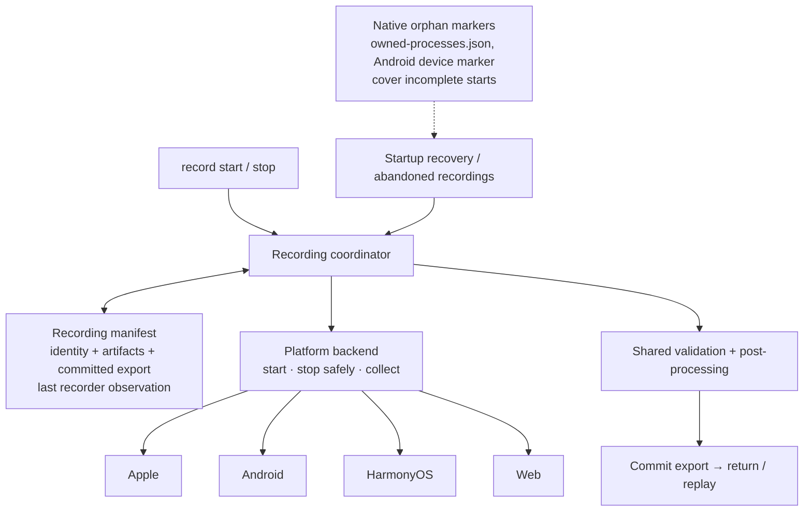

# ADR 0024: Screen Recording — One Coordinator, Two Facts

## Status

Proposed (2026-09-14). Amends ADR 0019
section 5 for the `screen-recording` resource kind only; ADR 0019 receives a short pointer
paragraph (2.7), the relationship ADR 0022 and 0023 have to it. App-log, audio-probe, and
perf-capture keep the ADR 0019 contract unchanged; rule 6's shared mechanism reaches each of them
only through that kind's own failed-finish test.

Two facts drive the design and are kept independent: **whether a playable export exists** and
**whether the recorder has stopped**. A playable export can exist while termination is
unconfirmed; a recorder can be stopped while its video still needs collecting. Both combinations
are legitimate, and one lifecycle cannot answer both questions.

## Rules at a glance

The shared contract is six situations. Everything platform-specific stays in the backend.

| Situation | Shared behavior |
| --- | --- |
| A recording is actively owned (its owner is alive and holds the fence) | Another start refuses without disturbing it |
| Stop produces a playable export | Commit it and return it with the recorder observation |
| Stop cannot produce an export | Preserve recoverable evidence, return the actual error, leave the manifest `open` |
| An export was already committed | Replay it, under the same session and device guards, without repeating stop work |
| The recorder or native-path disposition remains unresolved after a committed export | Retain the native path and identity in the manifest; authorized recovery may settle termination and disposition |
| Artifact cleanup is considered | Require ownership and proof that no recoverable output is destroyed |

Six rules make the table operational:

1. **Identity uncertainty alone never discards a usable export, and failures preserve retryable
   evidence.** That replaces "fail closed on uncertain ownership" as the recording policy. It is not
   "stop fails for exactly two reasons": storage, transport, cancellation, and manifest-commit
   failures remain real errors.
2. **Signalling lives entirely inside the backend.** The coordinator asks "stop safely within this
   budget" and receives an observation. Which signal, in which order, after which identity check,
   and whether a HarmonyOS toggle is safe are backend facts with different meanings per platform.
   Identity probes are private to the backend. A proven identity mismatch prohibits signalling in
   every backend; an unreadable probe is answered by the backend's own capability rules (2.3).
3. **One stop-and-export path.** Live and recovered recordings run the same steps: stop safely,
   collect, validate, commit. A live in-process handle helps the backend stop; its absence never
   selects a different algorithm.
4. **The recording manifest is the only lifecycle store.** Identity, artifacts, the committed
   export, and the last recorder observation live together in `screen-recording.resource.json`.
   `owned-processes.json` and the Android device marker cover only the window before a manifest
   exists (incomplete starts, chunk launches); they are not a second lifecycle database.
5. **Recovery selects work; the coordinator does it.** The coordinator serves two requests. A
   user stop **ensures an export**. Authorized recovery **settles the recorder**: it stops an
   unresolved recorder and completes safe native-path disposition, preserving a committed export
   untouched. Recovery enumerates abandoned or unsettled manifests and asks for one of the two
   under the ownership guard; it never kills processes or deletes files on its own.
6. **Export failure is not disposal.** A collection, validation, or commit failure preserves the
   material a retry needs. Forced cleanup is invoked only by session teardown and failed-start
   rollback, never inferred from "finish threw". The mechanism is in the shared coordinator
   (`capture-kit/durable-capture/transitions.ts`), but its scope is earned per kind: each of
   app-log, audio-probe, and perf-capture gets its own failed-finish test proving what its retry
   needs, and a kind whose retry needs nothing keeps its current disposal explicitly. The Android
   data loss alone establishes the rule for recording only.

Two later, independently proven steps are recorded so they are not re-litigated: reducing the
Android device marker to marker-only content (2.6), and `--time-limit 0` on API 34+ (2.8).

## 1. Context

`record start` / `record stop` is one command family, yet its last three months of fixes each
touched 10 to 35 files (#2447, #2457, #2487, #2534, #2564, #2565, #2566). The subsystem is ~10,150
production lines and ~19,000 test lines across `contracts`, `capture-kit`, `host-kit`, four
platform packages, nine `src/platform-runtime-screen-recording-*` hosts, and eight daemon modules.

Nine user-facing record bugs were filed since July 2026. Five were the ownership machinery refusing
on its own uncertainty:

| Issue | Refusal | Native cause? |
| --- | --- | --- |
| #2549 | `ps` 1 s probe timed out under load → `cleanup-pending`, session wedged | no |
| #2550 | device manifest `deviceId` ≠ current serial → "recovery evidence already exists" | no |
| #2476 | reused pid → "completed evidence cannot be safely retired" | no |
| #2281 | client window expired → no CLI path to the finished export | no |
| #1117 | daemon lost session state → "no active recording" | no |
| #2170 | CoreSimulator host lock after `SIGKILL` | yes |
| #1651 | validator rejected a static single-frame clip; `moov` patched in place | yes |
| #615 | `screenrecord` 180 s cap | yes |
| #2551 | clip ends at the last screen change | yes |

Three facts make the fail-closed contract cost more than it protects:

- **Reattachment is already dead on four of five backends.** `reattachAppleRecording`, the
  HarmonyOS and web operations return `unreattachable` unconditionally. After daemon loss,
  `finishRecoveredDurableCapture` runs descriptor cleanup and then **throws**, even when cleanup
  succeeded and the finalized MP4 is on disk. Only Android can answer `active` or `completed`. Ten
  ownership and outcome enums express distinctions four backends cannot make.
- **Daemon loss mid-recording is rare and already mitigated.** An active recording holds off the
  idle reaper. The startup reaper already `SIGINT`s orphaned `simctl recordVideo` children from
  `owned-processes.json`. The maintainer's local daemon logs hold zero recording reattachments; the
  reported failures are all ordinary same-daemon stops.
- **A failed export destroys its own retry.** `finishDurableCaptureHandle` calls
  `handle.forceCleanup()` when `finish` throws (`transitions.ts`, `compensateFailedFinish`). On
  Android that reaches `cleanupVerifiedAndroidEvidence`, which removes the remote artifact and
  marker. A pull that fails once under load leaves nothing to pull twice.

`#2551` was reproduced with raw `adb` on an API 36 emulator: `SIGINT` at +16 s produced a clip whose
last frame sits at +12.6 s, the last screen change; changes after the last input were captured. The
clip length is `screenrecord`'s change-driven encoding, not our stop path. Disclosure (PR #2566) is
the whole fix.

## 2. Decision

### 2.1 Shape



The coordinator reuses the existing manifest store, fence, pending-transfer guard, and completed
replay (PR #2534). No new framework.

### 2.2 The backend contract

```ts
type RecordingBackend = {
  start(input): Promise<{ handle: LiveHandle; descriptor: Descriptor }>;
  stop(target: LiveHandle | Descriptor, budget: Budget): Promise<StopObservation>;
  collect(descriptor: Descriptor, outputPath: string): Promise<Collected>;
};

type StopObservation =
  | { recorder: 'confirmed' }            // exit or stop acknowledgement observed
  | { recorder: 'unconfirmed'; why }     // identity unreadable, or no exit inside the budget
  | { recorder: 'lost'; why };           // identity proven not ours, or runner/browser session dead
```

`stop` accepts either the in-process handle or the persisted descriptor and decides internally
how to stop safely: the simulator backend kills its own `ChildProcess` and probes every descendant
marker before signalling it by pid (a `not-ours` marker is never signalled, as #2565 proves); the
Android backend probes `/proc` before `kill -2` exactly as `stopChunk` does today, and answers
`unconfirmed` instead of throwing when `/proc` is unreadable; the runner backend issues the stop
RPC bound to `runnerSessionId`; the HarmonyOS backend toggles once from its live handle and never
from a descriptor; the web backend stops the session browser. None of that sequencing is visible
to the coordinator.

`StopObservation.recorder` is the one word every backend must report; it fills the public
`recorder` field. It describes what was observed, never what identity proved.

Admission facts stay where they are: `screenRecordingStart` reports unavailable with
`DEVICE_IN_USE` and the writer named when a backend sees a foreign live recorder (Android:
`findRunning` over every `agent-device-recording-*` path, not only the one about to be reused;
simulator: `simctl` exit 16; runner and web: the provider reports an active recording).

### 2.3 The coordinator's stop

```
record stop  (request: ensure export)
  0. guard: session and device match; fence held
       manifest completed → replay the committed export (no stop work)
       fence lost with an open manifest → ownership-fence-lost
  1. backend.stop(handle ?? descriptor, budget)      → observation  (recorded; not a checkpoint)
  2. backend.collect(descriptor, collectedPath)      → immutable copy, playability sniff passed
                                                                      checkpoint: collected
  3. finalizer: overlay, telemetry: collectedPath → exportPath      checkpoint: finalized
  4. commit: manifest completed { export, recorder observation, native path disposition }; respond
```

**`collect` always produces a separate, immutable copy.** Every backend records into a *native
path* the recorder owns: the `simctl` output file, the runner's device file, the Android
`/sdcard` chunks, the HarmonyOS media item, the agent-browser WebM. `collect` copies (or pulls)
from the native path into `collectedPath`, a sibling of the caller's export path, and the
checkpoint is recorded once that copy passes the sniff. The native path is never the export and
is never finalized in place. On a local backend "collect" is a file copy, not "none": a playable
copy does not prove the native writer has stopped using its path, and on the simulator and web
that writer is exactly the process the observation may have left `unconfirmed`.

**Native-path disposition is a backend proof, recorded at commit.** The native path and the
recorder identity are retained after commit until the backend proves cleanup safe:
`recorder: 'confirmed'` (the writer exited or acknowledged), or the writer proven `gone` by a
later settle. A `lost` observation alone never permits deleting the native path: a pid identity
that no longer matches says nothing about who writes there now. HarmonyOS and web, which cannot
prove a writer gone, retain the native item until an explicit, fenced disposal (rule 6). Only the
collected copy may be finalized, and only the collected copy is removed after commit. Native-path
disposition is complete only after fenced retirement succeeds or the backend verifies the native
artifact is absent. A path marked retirable still needs its manifest until retirement completes.

**Checkpoints mark durable, valid artifacts; they never mark attempts.** `collected` is recorded
only after the collected copy passes the playability sniff (`ftyp` + `moov`, the existing check in
`video.ts`), so a pull of a not-yet-finalized MP4 leaves no checkpoint. `finalized` is recorded
after the export is written. Step 1 records its observation but is **re-attempted on every retry
while the observation is `unconfirmed` and no export is committed**: an Android `/proc` that was
unreadable once is probed again, and a recorder that has since become readable is signalled. A
`confirmed` or `lost` observation is not re-attempted. A retry resumes at the first missing
checkpoint after re-running step 1 when it must.

The collected copy is preserved until step 4 commits; the finalizer reads it and writes the
export beside it, so a retry after a failed commit re-runs nothing that changes the video. Today
`exportProcessedVideo` applies the touch overlay **in place** (`overlay.ts` renames the processed
file over its input; start trimming was removed by PR #2586), which is why the copy is required:
without it, a retry after a commit failure would burn the overlay twice. After commit the
collected copy is removed; a failed removal is a diagnostic, never an error.

Failures at 1, 2, 3, or 4 leave the manifest `open` with the recorded observation and checkpoints
and every artifact in place; the next stop re-drives as above (step 1 re-drive is what #2565
proves for the simulator today). No forced cleanup runs on that path (rule 6).

After step 4 commits, the manifest retains the native path, identity, recorder observation and
native-path disposition. The next `record stop` replays. Authorized recovery settles any unresolved
recorder or pending native-path disposition (2.5); a second stop never repeats that work.

```
settle recorder  (request: recovery only)
  0. guard: fence taken over; manifest open and abandoned, or completed with an
            unresolved recorder or pending native-path disposition
  1. unresolved recorder: backend.stop(descriptor, budget) → observation
     confirmed/lost recorder: do not repeat stop; inspect only pending artifact disposition
  2. completed manifest: persist recorder observation and native-path disposition;
     authorized retirement runs through the backend under the fence only when proven safe;
     a failed retirement leaves disposition pending; the committed export is not touched
     open manifest: continue as ensure export from the recorded phase
```

### 2.4 Start admission

`record start` runs in this order:

1. Refuse if the session already holds a live handle (`recording already in progress`).
2. Refuse if the device's recording manifest is `open` and **actively owned**: the owner named in
   the manifest is alive by the existing owner-identity check (`host-kit/internal/owner-identity.ts`)
   and holds the fence. This is the ADR 0019 rule; it is unchanged.
3. Otherwise the manifest is abandoned or completed. Hand it to recovery (2.5) under the ownership
   guard **before** launching. Recovery may end an `ours` recorder and collect its export into the
   old session's manifest; it never deletes what it cannot prove abandoned.
4. Ask the backend's admission fact. A foreign live writer is `DEVICE_IN_USE` naming the writer.
5. If the session's current manifest is still unsettled after recovery (`open`, or `completed`
   with an unresolved recorder or pending native-path disposition), **archive it under its fence
   generation** before adoption:
   `screen-recording.resource.json` → `screen-recording.<generation>.resource.json`, an atomic
   rename in the same session directory. The store lists both shapes (`store.list` already walks
   session directories; it gains the glob), and the next fence generation is the maximum over
   every manifest in the directory plus one, not the current file plus one as
   `createNextDurableCaptureFence` computes today.
6. Launch under a new artifact path and that fence generation.

A completed manifest, a manifest naming another serial, a reused pid, or an unreadable process
table no longer refuses a start. They are recovery inputs, not admission inputs. Adoption never
overwrites a manifest that recovery could still need: the one-file-per-session layout stays for
the *current* recording, and unsettled predecessors remain durably enumerable by generation. An
archived manifest is removed only after its export is committed and its native-path disposition
is complete. Neither `confirmed` nor `lost` alone retires that recovery record: a stopped writer
can leave an artifact awaiting disposal, and a lost identity does not prove disposal safe.
`record stop` and replay read only the current manifest; archived ones belong to recovery.

### 2.5 Recovery

Recovery has two entry points and one body. At daemon start, and at step 3 of admission, it
enumerates manifests (`store.list`, already present; current and archived generations) that are
`open` and not actively owned, or `completed` with an unresolved recorder or pending native-path
disposition. For each, it acquires the ownership guard (the existing fence takeover; a stale fence
is left alone with a diagnostic) and asks the coordinator to **settle the recorder** (2.3). A
confirmed or lost recorder with pending disposition still participates: the backend inspects
artifact disposition without signalling again. The coordinator persists disposition after
authorized, fenced retirement succeeds or the backend verifies the artifact is absent. Until
then, the manifest remains enumerable for retry or explicit teardown. The committed export is
never re-collected, re-finalized, or replayed. An open abandoned manifest continues as
ensure-export from the recorded phase.

Recovery therefore never decides signals or deletions itself. An `open` manifest whose backend
answers `lost` and whose artifact is playable is committed as an export with `recorder: 'lost'`;
one whose artifact is unplayable stays `open` with its evidence retained and a diagnostic. The
existing `owned-processes.json` reaper keeps its narrow job: native children left behind by an
incomplete start, before any manifest existed; it prefers `SIGINT` for `simctl` (#2457).

Artifact cleanup is a separate, explicit decision (rule 6): session teardown and failed-start
rollback dispose through the backend under the fence, and only after the manifest records that no
recoverable export is lost.

### 2.6 Native markers

`owned-processes.json` (simulator recorders) and `/sdcard/agent-device-recording-active.json`
(Android launch and chunk rotation) cover the windows between spawning a native recorder and
publishing the manifest that names it. They stay. What changes is their content: the Android
device marker stops carrying lifecycle (completion, `deviceId` gating, fence generation as an
admission key) and becomes identity plus pending chunk path, read only by the Android backend's
`stop` and by its incomplete-start recovery. Deleting it outright is deferred until the launch and
rotation crash windows are shown to be covered by the manifest alone.

### 2.7 ADR 0019 amendment

Section 5 currently requires every durable facet to expose `reattach` and `cleanup`, keep uncertain
cleanup `cleanup-pending`, and (in `transitions.ts`) run forced cleanup when finish throws. The
amendment: *screen recording is a **stop-and-collect** resource. It keeps the manifest, the fence on
every destructive step, and the completed replay. It replaces `reattach` and `cleanup` with the
backend's `stop(target)` and `collect`, drops `cleanup-pending` as a phase and the admission ledger
for this kind, and records the recorder observation beside the committed export. For every durable
kind, forced cleanup is no longer inferred from a failed finish.*

### 2.8 Android duration (separate decision)

`screenrecord --time-limit 0` removes the cap on API 34 and later (help text, API 36 emulator;
AOSP added the option in API 34). On those devices one artifact and no rotation; below API 34,
rotation stays. This lands after 2.1–2.7 and is not required by them.

## 3. Cross-platform matrix

| Backend | `stop` from a live handle | `stop` from a descriptor (recovery) | `collect` | Today after daemon loss |
| --- | --- | --- | --- | --- |
| iOS / tvOS simulator | `ChildProcess.kill` tiers; descendant markers probed before pid signals | probe markers; signal on ours; `unconfirmed` if the host is silent; `lost` on mismatch | local copy of the `simctl` output file; native file retained until the writer is proven gone | cleanup signals, then **throws** |
| iOS device (CoreDevice), macOS | runner stop RPC bound to `runnerSessionId` | same RPC if the runner session matches; `lost` if the runner restarted | device copy (iOS); local copy of the runner's output file (macOS) | cleanup stops the runner, **never retrieves**, throws |
| Android | probe `/proc`, then `kill -2` → `-9`; `unconfirmed` when `/proc` is unreadable | same, from the pid triple in the descriptor | `adb pull` of every chunk, playability sniff | reattach through the device manifest; five ownership states |
| HarmonyOS | one `aa start` toggle, tracked by the handle | **no signal**; `mediatool query` by file name; `unconfirmed` if found, `lost` if not | stage + `hdc file recv` | `cleanup-pending`, manual |
| Web | provider `record stop` on the session browser | stop if the browser is alive, else `lost` | local copy of the WebM; native file retained while the browser is not proven gone | `cleanup-pending`, manual |
| Limrun, WebDriver providers, Vega | unavailable | — | — | unchanged |

Two traps stay visible: a blind HarmonyOS toggle **starts** a recording, so only the live handle
may toggle; and the Apple runner recording dies with the runner process, so `lost` after a keep-hot
restart is correct, not a state to defend against.

## 4. Compatibility

Every published surface changes additively.

| Surface | Change | Breaking? |
| --- | --- | --- |
| Node client `RecordingStopCommandResult` | adds optional `recorder` and `capturedDurationMs` | no |
| MCP `record` output schema | two optional properties; required list unchanged | no |
| Daemon RPC (ADR 0006) | optional response fields; no protocol bump; wire ledger `compatibleChanges` entry | no |
| Error `details.reason` `cleanup-unconfirmed`, `resource-missing` | `record stop` stops emitting them; `ownership-fence-lost` stays; the union stays for the other kinds | no |
| CLI exit status | `record stop` after daemon loss on Apple, HarmonyOS, and web exits 0 with a warning where it exited 1 | behavior change, CHANGELOG |
| Runtime operations `screenRecordingReattach` / `screenRecordingCleanup` | removed; workspace-internal | no |
| Persisted manifests | newer daemons read every older shape; older content is recovery input | no |
| Android API < 34 | unchanged | no |

## 5. Tests

**Keep as written**: #2565's handle-stop, next-stop re-drive, and never-signal-a-reused-pid tests;
#2564's stranded-serial retirement and live-writer refusal; #2534's replay; every fence-loss test;
#2487, #2447, #2457, #1651, #2566.

**Flip**: #2564 "refuses a stranded interrupted launch whose writers cannot be read" → the start
proceeds after recovery retains the evidence; "retains open evidence … after its recorder is gone"
→ recovery commits or retains it, then the start proceeds. #2565 "refuses to signal a live process
whose identity nobody can read" → still no signal, and the stop completes as `unconfirmed` when a
playable file exists. Every post-daemon-loss `record stop` error on Apple, HarmonyOS, and web → a
completion with `recorder`, or an error that leaves evidence in place.

**Add before removing anything** (one per backend where the row applies):

- Finish fails at collect → no `forceCleanup`, remote artifact and manifest intact, manifest
  `open`, second stop succeeds. (Rule 6; today this deletes the Android artifact.) One such test
  per durable kind, each stating what its retry needs; a kind that keeps disposal says so in the
  test name.
- Commit fails after finalize (overlay applied) → manifest `open` at phase `finalized`, collected
  copy present; the retry commits without invoking the finalizer again (spy), and the export is
  unchanged byte-for-byte.
- Simulator and web: stop returns `unconfirmed` while the native writer is still alive, the
  collected copy passes the sniff → completion `unconfirmed`, export served from the copy, native
  file untouched and still open by the writer; a later settle that proves the writer gone records
  the native path as retirable; a `lost` observation alone leaves it in place.
- `ours` signalled, no exit inside the budget → completion `unconfirmed`; next stop replays without
  calling the backend (spy); startup recovery calls the backend stop, rewrites the observation to
  `confirmed`, and the export file is unchanged.
- Android stop with `/proc` unreadable → no `kill` sent, artifact pulled, `unconfirmed`; with
  `/proc` naming another process → no `kill`, `lost`.
- Android stop with `/proc` unreadable and the pull returning a `moov`-less file → no `collected`
  checkpoint, manifest `open`; `/proc` readable on the retry → `kill -2` sent, exit observed,
  re-pull passes the sniff, completion `confirmed`. A recorded attempt never implies termination.
- Start over a session whose manifest is `completed` with `recorder: 'unconfirmed'` → the manifest
  is archived under its generation, the new manifest gets generation + 1, `store.list` returns
  both, and recovery later settles the archived one and removes it. Adoption never overwrites
  unresolved evidence.
- Completed export with a `lost` recorder and native disposition still pending → start archives
  the manifest, recovery retains its path and identity, and no native deletion is authorized by
  `lost` alone. The archive is retired only after backend proof and fenced disposition complete.
- Confirmed recorder with a failed native-artifact retirement → start archives the manifest,
  recovery still enumerates it and retries only disposition; a failed retry retains the manifest,
  a successful retry permits archive removal, and the committed export is unchanged throughout.
- HarmonyOS live stop issues exactly one toggle; recovery issues none.
- Start over an actively owned open manifest → refused; over an abandoned one → recovery runs
  first, old artifact retained unless committed, start proceeds under a new path.
- Start with a live writer on a previous timestamped Android path → `DEVICE_IN_USE` naming it.
- Stale fence with a committed completion → replay; stale fence with an `open` manifest →
  `ownership-fence-lost`, no signal sent.

**Delete**: `cleanup-pending` phase branches for recording, reattach/cleanup unit tests in the four
platform packages, Android completed-evidence refusal tests.

## 6. Refuted alternatives

- **Keep fail-closed, keep patching evidence branches.** The current trajectory (#2487, #2564,
  #2565). Each patch is correct and adds a state; the next branch arrives within weeks.
- **Delete the daemon manifest for recording.** The replay needs a durable home and the fence is
  what keeps a stale owner from mutating a resource it no longer holds.
- **A public `probe` + `stop(level)` backend interface.** Rejected: it exposes signal sequencing
  the coordinator must not own, and a live handle could bypass the identity check.
- **`owned-processes.json` as the sweep list.** Rejected: a second lifecycle database beside the
  manifest. It keeps its incomplete-start job only.
- **Recovery that signals and deletes on its own.** Rejected: it duplicates the coordinator under
  weaker guards. Recovery selects work; the coordinator does it under the fence.
- **Retire unresolved evidence at start.** Rejected: an unprovable recorder may still be writing.
- **Delete the Android device marker now.** Deferred: it covers launch and rotation crash windows
  the manifest does not yet cover.
- **Drop chunk rotation everywhere.** Rejected: below API 34 that loses everything after 180 s.

## 7. Rollout

1. Merge the open regression PRs (#2564, #2565, #2566). Done; PR #2586 (start trimming removed)
   is also on `main`, so the finalizer is overlay and telemetry only and the trim-related
   `invalidTrimRange` and `trimStartMs` surfaces no longer exist in the contracts this ADR names.
2. Rule 6 in the shared coordinator, gated per kind: a failed finish no longer runs forced
   cleanup for a kind once that kind's failed-finish test states what its retry needs. Recording
   first; the other three kinds each in their own commit. Independently shippable.
3. Consolidate **stop, export, and replay** with existing primitives: the coordinator stop of 2.3,
   `recorder` and `capturedDurationMs` on the response, recovery through the coordinator (2.5),
   admission order of 2.4. No operation removed, no store moved. Closes the class behind #2549,
   #2550, #2476, #2281.
4. Replace `reattach` / `cleanup` with backend `stop(target)` / `collect`; delete the stop-recovery
   plan, exact-owner recovery control, and the admission ledger for recording.
5. Reduce the Android device marker to marker-only content (2.6), with the crash-window tests.
6. `--time-limit 0` on API 34+ (2.8).
7. Amend ADR 0019 section 5; update `commands.md`.

Each step is independently proven live per ADR 0019 evidence rules: iOS simulator, Android
emulator API 34+ and one API < 34 image, macOS runner, HarmonyOS if a device is available, web.
Each backend proves the ordinary stop, the host-silent stop, the post-daemon-loss stop, the
collect-failure retry, and the stale-caller refusal.

## 8. End state

| Area | Before | After step 4 | After step 5 |
| --- | --- | --- | --- |
| `contracts` recording types, ops, plan | 505 | ~350 | ~350 |
| `platform-android/recording` | 1,566 | ~1,100 | ~800 |
| `platform-apple/recording` | 685 | ~450 | ~450 |
| `platform-harmonyos/recording` | 386 | ~300 | ~300 |
| `platform-web/recording` | 171 | ~140 | ~140 |
| nine `src/platform-runtime-screen-recording-*` hosts | 1,325 | ~1,100 | ~1,000 |
| `src/daemon` recording modules | 899 | ~500 | ~500 |
| shared: finalizer, durable-capture, host-kit, commands, layering, Swift | ~4,600 | ~4,600 | ~4,600 |
| **Recording-specific total** | **~10,150** | **~8,500** | **~8,100** |
| Recording test lines | ~19,000 | ~15,000 | ~14,000 |
| Ownership / outcome enums | 10 | 3 | 3 |
| Runtime operations for recording | 3 (start, reattach, cleanup) | 3 (start, stop, collect) | 3 |
| `record stop` paths | 2 (live; recovery that throws on 4 backends) | 1 | 1 |
| Files on an Android stop path | 9 | ~7 | ~6 |

The reduction is modest because the device marker stays, the root host files stay, and rotation
stays below API 34. What this design buys is one path, one store, three enums, and no refusal that
a silent host or a reused pid can produce. A later, separate ADR may fold the nine root host files into per-platform transports
once the layering gates (R16) are re-cut; that is shape, not policy, and it is not needed for any
row of section 1's table.

Deletion test: `screenRecordingReattach`, `screenRecordingCleanup`, `cleanup-pending` for
recording, and `ScreenRecordingAdmissionLedger` no longer exist in production; `transitions.ts`
has no cleanup-on-failed-finish path; every situation in the rules table has a passing test on
every backend where it applies.
