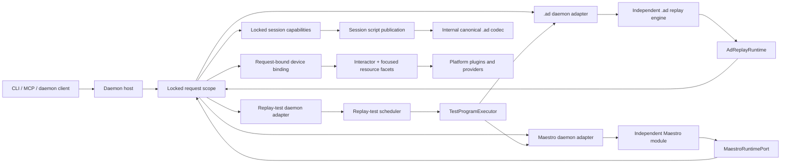

# Proposal: make daemon a serialized host, not the home of every runtime

Status: revised design context; implementation handoff:
[`#1478`](https://github.com/callstack/agent-device/issues/1478)

Measured at: `e545544dfa85`

## Recommendation

Keep the daemon as the serialized application host:

- transport and authentication;
- request admission, cancellation, locks, and leases;
- request-scoped provider binding;
- session ownership and teardown;
- diagnostics, artifacts, response projection, and finalization.

Move program semantics behind independent module APIs:

- native `.ad` replay;
- Maestro;
- replay-test scheduling and reporting.

Keep script-publication lifecycle in a session-owned capability. Native replay owns planning and
execution semantics, a pure internal codec owns canonical `.ad` syntax, and the session capability
owns publication validation. Active publication, ordinary and repair close-time publication,
repair commit, idle reap, and shutdown all consume live session state and must remain one
transactional authority.

Connect those modules to daemon-owned capabilities through adapters created inside the already
admitted and locked request scope. Do not give an engine `DaemonRequest`, `DaemonInvokeFn`,
`SessionStore`, mutable `SessionState`, a provider handle, or a platform implementation.

The organizing rules are:

> State crosses boundaries as values, authority crosses as capabilities, and both only narrow.
>
> A boundary exists when its port has two implementations; otherwise it is indirection.

The durable communication, state-consistency, R7, and locality rules live in
[`module-interface-principles.md`](module-interface-principles.md). This proposal applies them to
the daemon: immutable data travels down through façades, calls travel back through ports, and the
daemon adapter closes each capability over one already admitted request. Control flow stays
call-based; ADR 0018's journal is observation only, never an inter-module event bus.

Make logical boundaries and one-way imports work under `src/` first. Consider private pnpm workspace
packages only after a module no longer reaches back into root source and a measured package trigger
exists. A package that imports `../../src/daemon` is a directory with a `package.json`, not
encapsulation.

## Why change

The production graph is acyclic and passes the repository's layering gates. The problem is not
spaghetti dependencies; it is weak information hiding and poor locality.

| Production zone | Files | LOC |
| --- | ---: | ---: |
| daemon-server | 221 | 46,504 |
| platforms | 173 | 33,608 |
| commands | 110 | 16,468 |
| compat | 47 | 8,068 |
| utils | 72 | 7,278 |
| contracts | 83 | 6,756 |
| core | 32 | 6,526 |
| cli | 33 | 6,087 |
| replay | 22 | 4,339 |

Relevant slices:

| Slice | Files | LOC |
| --- | ---: | ---: |
| daemon `session-replay*` | 23 | 5,361 |
| native replay part of that slice | 19 | 4,297 |
| daemon replay-test runner | 8 | 1,967 |
| daemon Maestro integration | 4 | 1,064 |
| Maestro daemon adapter misplaced under `compat` | 5 | 1,549 |
| all Maestro production files under `compat` | 46 | 8,041 |
| Maestro engine/policy after removing daemon adapter files | 41 | about 6,492 |

The test locality cost is larger than the production table suggests:

- 27 daemon replay test files: 12,855 physical lines;
- 8 daemon replay-test files: 1,899 physical lines;
- 34 Maestro test files: 6,831 physical lines;
- `session-replay-vars.test.ts` alone is 2,299 lines.

The dependency graph has zero value cycles and zero ranked back-edges. At the same time:

- daemon-server has 117 collapsed dependencies on platforms, including 80 value dependencies;
- the dependency audit classified 88 daemon-server platform-condition branches, more than the
  platform tree itself, so dependency direction alone understates the coupling;
- daemon-server has 22 dependencies on compat;
- compat has 5 dependencies back into daemon-server;
- `daemon/types.ts` is 508 lines with 155 production importers;
- `session-store.ts` has 62 production importers;
- `SessionStore.get()` returns a live mutable record whose aliasing is the persistence mechanism.

The largest value-plus-type strongly connected component is 102 files. Its cycles are type-only,
so this is not a runtime correctness problem, but it is a locality problem. A fresh membership
probe at the measured commit finds 30 daemon files in that component, but none of the
`session-replay*`, `session-test*`, or `compat/maestro` engine files. Engine extraction therefore
must not claim this reduction. Session-state and platform-contract work in Phases 3 and 5 is where
the R9 baseline can shrink. In particular, `SessionState` has two direct type imports from concrete
platform perf implementations, but only the Apple `perf-xctrace.ts` edge is load-bearing: removing
it reduces the component from 102 files / 30 daemon files to 91 / 21. Removing only the Android
`perf.ts` edge leaves 102 / 30 unchanged, and removing both produces the same 91 / 21 as Apple
alone. The Android move is still ownership hygiene; it must not be credited with the SCC reduction.
The replacement Apple resource handle must not recreate the upward edge.

Moving files without changing those interfaces would reduce a folder count while preserving the
reasoning burden.

## Architectural constraints from the ADRs

The migration must preserve these decisions:

1. Providers remain below platform translation so provider integration tests exercise real platform
   behavior (ADR 0001).
2. Platform helper reuse remains an optimization owned by the daemon/platform host; do not invent
   one universal cross-platform runner (ADR 0002).
3. Daemon route and request policy remains private and distinct from public command metadata
   (ADR 0003).
4. This is an implementation-only refactor for every supported surface: preserve the daemon RPC
   request/response wire and do not bump `rpcProtocolVersion` (ADR 0006). Phase 3 deliberately closes
   one accidental raw-RPC behavior—`record stop` with unsupported `flags.saveScript`—by rejecting or
   ignoring that flag at the daemon seam. That behavior is wire-observable but absent from the CLI,
   Node, and MCP contracts; pin the intended refusal before deleting its writer path rather than
   treating adversarial input as a supported command contract.
5. Device/session locking and lease admission retain their current ordering (ADR 0007).
6. Command identity remains derived from `CommandDescriptor`; in-process `execute` and
   cross-process `invoke` remain distinct (ADR 0008).
7. Keep the consolidated Apple-family model and its AppleOS discriminant/leak guard (ADR 0009).
8. Module failures preserve the ADR 0010 wire contract: `code`, `message`, `hint`, `details`,
   `diagnosticId`, `logPath`, and optional typed `retriable`/`supportedOn` signals.
9. The guarantee matrix remains honest about every interaction path and fast path (ADR 0011).
10. Native replay retains target verification, structured divergence, plan-digest-bound resume,
   agent-supervised repair, and no-clobber publication (ADR 0012).
11. Follow the ADR 0013 precedent at platform seams: normalize once into a canonical contract and
    let adapters consume it rather than reinterpreting intent.
12. Ref admission and synchronous expiry remain at the actual daemon side-effect seam, including a
   mutation that may have failed after changing the device (ADR 0014).
13. Maestro remains a source-preserving typed engine over its own runtime port. It must not lower
   into native replay or share a replay VM with `.ad` (ADR 0015).
14. Active publication computes `sessionActive` from the daemon store, keeps ordinary publication
    disjoint from repair state, and preserves the ARMED/ABORTED/PUBLISHED lifecycle (ADR 0016).
15. Sensitive live values are parameterized before durable recording or publication (ADR 0017).
16. If ADR 0018 proceeds, progress remains a separate transport output port rather than a generic
    journal event.

## Designs considered

### A. Folder reshuffle only

Move `session-test*` to `src/replay/test`, move Maestro files to `src/maestro`, and split the large
handler directory.

This is useful as a migration step, but insufficient as the design. If the moved modules still
accept `DaemonRequest`, `SessionStore`, and `DaemonInvokeFn`, contributors can cross every boundary
exactly as before.

### B. One universal ProgramRunner or shared effect VM

Put `.ad` and Maestro in one package and make both yield a common `ProgramEffect` union.

This makes the diagram small but the module shallow. `.ad` is a linear `SessionAction` format with
target-v1 verification and repair publication. Maestro has structured control flow, scoped
variables, script outputs, compatibility selector semantics, observation generations, and its own
resume restrictions. Their common execution vocabulary would either:

- encode the semantic cross-product;
- become a generic daemon command trampoline; or
- quietly erase behavior ADR 0015 made explicit.

Rejected. Share test-level outcomes and host capabilities, not interpreter semantics.

### C. Big-bang workspace and universal DeviceGateway

Immediately create packages for daemon, replay, Maestro, every platform, providers, contracts, and
UI trees. Replace the current platform/provider paths with one broad gateway.

This gives hard physical boundaries, but the current engines still import root kernel, selector,
snapshot, request, and utility modules. Doing this first forces a root/package cycle or a broad
`foundation` package. It also puts tsdown bundling, declaration generation, dynamic platform loading,
and npm packaging on the critical path of a behavior-preserving refactor.

Rejected as the first move. A request-bound device binding is promising later, but should compose
the existing `Interactor` and focused resource facets instead of replacing them with one tagged
`observe/interact/manage/resource` union.

### D. One Redux-like or request-transactional session store

Route every session mutation through actions/reducers and commit or roll back at request completion.

Rejected. ADR 0014 requires ref-frame expiry to commit synchronously immediately before an
asynchronous device operation and to survive that operation's failure. End-of-request rollback
would recreate the success-only-rollback bug. Repair/publication are staged protocols with
failure-preserving tombstones, while actions/events are append-only streams; forcing all three
consistency disciplines through reducers adds a shallow translation layer. The request lock,
single-threaded runtime, capability-owned transitions, R7, and event audit trail already provide
the useful guarantees.

### E. Domain-first strangler; workspaces only when earned

Create small public façades around demonstrated domains, keep daemon-owned adapters at the outside,
and tighten the import graph after each move. Once a module has no root back-edge, keep the logical
module unless an independent build/consumer or an enforcement failure earns a package.

Recommended.

## Target architecture



The daemon adapter closes over one admitted request. Engine APIs do not accept an arbitrary session
name for mutation and cannot reacquire locks, switch provider scope, or address another session.

Use three explicit visibility levels:

| Surface | Visibility | Allowed consumers |
| --- | --- | --- |
| `.ad` engine façade and runtime types | module-public through `src/ad-replay/index.ts` | daemon `.ad` adapter |
| Maestro façade and runtime port | module-public through `src/maestro/index.ts` | daemon Maestro adapter |
| replay-test façade and host port | module-public through `src/replay/test/index.ts` | daemon replay-test adapter |
| canonical `.ad` codec | repository-private leaf contract | `.ad` engine and session script publication only |
| `SessionScriptPublication`, replay transaction, resource ledger | daemon-private capabilities | locked request and lifecycle coordinators |
| `LockedSessionContext`, `DaemonRequest`, provider handles | daemon-private implementation | daemon adapters and composition only |
| engine IR, parsers, mutable plan state | implementation-private | their owning engine |

“Module-public” means the reviewed internal API other modules may import; it does not add an npm
export or change the daemon wire. Imports into an `internal/` directory fail the boundary gate.

## Proposed module APIs

### Native `.ad` replay

Prepare once, then execute an opaque plan:

```ts
export interface AdReplayEngine {
  prepare(input: AdReplayPrepareInput): Promise<PreparedAdReplay>;
  execute(
    prepared: PreparedAdReplay,
    input: AdReplayExecutionInput,
    runtime: AdReplayRuntime,
  ): Promise<AdReplayOutcome>;
}
```

`PreparedAdReplay` is opaque except for an immutable summary: source identity, plan digest, step
count, effective metadata, and static target hint. `AdReplayExecutionInput` carries runtime values
and an optional client-supplied resume claim:

```ts
export type AdResumeClaim = {
  from: number;
  planDigest: string;
};
```

`prepare` computes the digest from the freshly expanded plan; `execute` validates the claim against
that exact prepared plan. There is no daemon checkpoint keyed by digest and no second parse between
inspection and execution.

The engine receives a small earned runtime port:

```ts
export interface AdReplayRuntime {
  readonly signal: AbortSignal;

  executeStep(input: AdStepExecution): Promise<AdStepOutcome>;

  /**
   * Capture a replay observation and atomically update the session observation plus
   * the exact partial ref frame exposed by the outcome.
   */
  observeReplay(input: AdObservationRequest): Promise<AdObservation>;

  emitProgress(event: AdProgressEvent): void;
}

export type AdStepExecution = {
  action: SessionAction;
  source: {
    scriptPath: string;
    sourcePath: string;
    line: number;
    ordinal: number;
  };
  provenance: 'authored-ad-step';
  recordAs?: string;
  targetGuard?: ReplayTargetGuardDenotation;
  waitLandmark?: TargetAnnotationV1;
};
```

The daemon runtime adapter owns translation to `DaemonRequest`, parent flag merging,
`internal.replayPlanStep`, target/landmark guards, session-scope inheritance through
`internal.resolvedSessionScope`, request-level provider-scope reuse, and response/error projection.
`observeReplay` deliberately combines capture, stored observation update, and exact partial-frame
activation. Splitting those operations would expose an illegal intermediate state under ADR 0014.

The engine receives no session interface. A daemon-owned coordinator wraps `execute` inside the
already locked scope:

1. Before execution, it validates the session-specific corrective-action watermark and configures
   repair recording.
2. The runtime adapter arms recording when execution creates the session.
3. After a divergence outcome, it stores the returned resume watermark.
4. After success, it marks the repair transaction complete.
5. It maps the typed outcome into the daemon response and lifecycle decision.

Arm, watermark, complete, abort, and tombstone operations remain private session implementation
details; they are not engine-callable methods. The production and deterministic in-memory runtime
adapters make `AdReplayRuntime` an earned seam rather than speculative indirection.

### Session script publication

Publication is a session capability, not a native replay runtime entry point:

```ts
type ScriptPublicationTarget = Readonly<{
  path: string;
  source: 'generated' | 'explicit' | 'healed-sibling';
  force: boolean;
}>;

type RepairPlatformCloseReceipt = Readonly<{
  operationKey: string;
}>;

interface SessionScriptPublication {
  publishActive(input: ActivePublicationRequest): Promise<ScriptPublicationOutcome>;
  finalizeExplicitClose(input: {
    retarget?: { path: string; force?: true };
    platformClose: {
      operationKey: string;
      perform(): Promise<void>;
    };
  }): Promise<ScriptPublicationOutcome>;
  finalizeLifecycleTeardown(
    reason: 'idle-reap' | 'daemon-shutdown',
  ): Promise<ScriptPublicationOutcome>;
}
```

This is a daemon-private, request-bound capability. Passing `platformCloseSucceeded: boolean` would
lose the operation identity and make sequencing the caller's responsibility. Instead, the
capability receives one narrow close operation and controls when it runs and when its success
receipt commits. It owns:

- ADR 0016 eligibility, ARMED/ABORTED/PUBLISHED transitions, and repair-state disjointness;
- mutually exclusive tagged ordinary-recording and repair states rather than co-resident mutable
  flags that callers must interpret;
- publication-side repair commit/tombstone transitions from ADR 0012;
- action-slice selection, durable target/per-target force authorization, close receipts, and retry
  semantics;
- portability, unresolved-ref, target-evidence, and destination-guard validation;
- atomic create-exclusive or explicitly forced replacement;
- the store-derived active-session view used by response projection; and
- coordination across active publication, ordinary close, repair close, idle reap, and daemon
  shutdown.

`SessionScriptPublication` and a daemon-private `ReplaySessionTransaction` are two capability
projections over one private tagged aggregate, not two copies of session state. The replay
projection owns arm, corrective-action watermark, divergence, completion, and abort transitions;
the publication projection owns all artifact eligibility and commit transitions. Only the
daemon-owned locked replay coordinator sees the replay projection, and neither projection is passed
to an engine.

> **Do not implement the following sketch verbatim.** It illustrates the one-aggregate/two-projection
> invariant and the minimum retry state. Issue
> [`#1478`](https://github.com/callstack/agent-device/issues/1478) owns the exact worker contract and
> supersedes this TypeScript wherever it is more specific.

The current cluster of co-resident flags collapses into one state:

```ts
type OrdinaryPublicationStatus =
  | { kind: 'armed' }
  | { kind: 'published'; path: string }
  | { kind: 'aborted'; reason: 'second-open' };

type RepairPublicationStatus =
  | { kind: 'armed' }
  | { kind: 'complete' }
  | {
      kind: 'close-succeeded';
      completion: 'armed' | 'complete';
      receipt: RepairPlatformCloseReceipt;
    }
  | { kind: 'committed'; path: string; receipt?: RepairPlatformCloseReceipt }
  | {
      kind: 'aborted';
      reason: 'explicit-close-incomplete' | 'lifecycle-incomplete' | 'teardown-commit-failed';
      receipt?: RepairPlatformCloseReceipt;
    };

type SessionScriptState =
  | { kind: 'inactive' }
  | {
      kind: 'ordinary';
      target: ScriptPublicationTarget;
      status: OrdinaryPublicationStatus;
    }
  | {
      kind: 'repair';
      boundary: number;
      sourcePath: string;
      target: ScriptPublicationTarget;
      watermark?: ResumeWatermark;
      status: RepairPublicationStatus;
    };
```

ADR 0016 ordinary publication and ADR 0012 repair ownership are then type-level alternatives,
rather than nullable fields whose legal combinations every caller must remember. The repair close
transaction has one required ordering:

1. Derive a candidate target from the request without mutating state. Force remains authorization
   for one target: changing the path without a live `force` clears the old authorization.
2. If no receipt matches the effective platform-close operation key, perform that close. A failure
   leaves the aggregate byte-for-byte unchanged.
3. After close succeeds, persist the target and `close-succeeded` receipt before attempting atomic
   publication.
4. If publication fails, retain that state. A retry with the same close operation skips platform
   dispatch and can safely retarget publication; a different operation key dispatches again.
5. Publication transitions to `committed`, retaining its receipt until the lifecycle coordinator
   deletes the session. An incomplete repair transitions to explicit `aborted` state and never
   publishes. Teardown persists the existing bounded tombstone before deleting failed or incomplete
   repair state.

The tagged aggregate and both capability projections must land together; do not temporarily keep a
second repair/publication state beside it. Centralizing the callers behind the locked replay
coordinator can follow as a separate migration step because it changes orchestration, not state
ownership.

It uses an internal pure `.ad` codec for canonical serialization. The codec is shared syntax, not
the replay engine and not an injected port; the local filesystem remains directly testable through
temporary directories. Publication never asks replay to interpret `SessionState`, and replay never
owns session deletion or lifecycle ordering.

This is the highest-risk extraction. Today `session-script-writer.ts` owns artifact preparation and
atomic commit, while active eligibility/transitions, close sequencing, and teardown tombstones live
in separate callers. There are five production `writeSessionLog` call sites: active publication,
ordinary close, repair close, lifecycle teardown, and a **surface-dormant** call after record-only
`record stop`. Supported CLI, Node, and MCP surfaces cannot attach `saveScript` to `record`, but a
raw JSON-RPC request can: `recordSessionAction` mirrors unvalidated request flags,
`recordActionEntry` sets `recordSession` when `saveScript` is truthy, and
`releaseRecordOnlySession(..., { writeLog: true })` then reaches the writer. This is accidental
daemon-seam behavior—there is no daemon-side per-command flag allowlist—not a fifth supported
publication trigger. Closing it is ADR 0003-compatible hardening, not a public contract removal.
First pin that every `record` action rejects or ignores `saveScript` without arming publication;
then delete the writer call. Preserve the four supported semantics behind one capability before
moving formatting code.

### Maestro

Keep the existing deep runtime port:

```ts
export type MaestroRuntimePort = {
  execute(request: MaestroRuntimeRequest): Promise<MaestroRuntimeResult>;
  observe(request: MaestroObservationRequest): Promise<MaestroObservation>;
  readMetrics?(): MaestroRuntimeMetrics;
};
```

Add one façade:

```ts
inspectMaestroFlow(source): MaestroFlowManifest;
prepareMaestroFlow(source, options): Promise<PreparedMaestroFlow>;
executeMaestroFlow(
  prepared,
  runtime: MaestroRuntimePort,
  options,
): Promise<MaestroRunOutcome>;
```

`PreparedMaestroFlow` is opaque except for stable metadata such as digest and step total. Typed
failure identity should be returned in `MaestroRunOutcome`, not reconstructed from a best-effort
observer side channel.

Move these daemon-specific files out of the Maestro module:

- `daemon-runtime-port.ts`;
- `daemon-runtime-port-support.ts`;
- `daemon-runtime-port-observation.ts`;
- `daemon-runtime-port-snapshot-source.ts`;
- `daemon-runtime-public-operation.ts`.

Their destination is `src/daemon/adapters/maestro/`. Neutral snapshot presentation and tree helpers
with both daemon and Maestro consumers move to `src/snapshot/`.

Of these five files, `daemon-runtime-port-support.ts` and
`daemon-runtime-public-operation.ts` directly import `daemon/types.ts`; the other three are
daemon-specific by role rather than by that direct dependency.

No code outside Maestro imports its IR, plan steps, parser, selector ranking, expression state, or
compatibility internals.

### Replay-test

The test runner is the highest-confidence extraction. It already has one production caller and a
real callback seam:

- `runReplay`;
- `cleanupSession`;
- `finalizeAttempt`.

Its public API should become:

```ts
export function runReplayTestSuite(
  request: ReplayTestSuiteRequest,
  host: ReplayTestHost,
): Promise<ReplayTestSuiteResult>;

export interface ReplayTestHost {
  inspect(sourcePath: string): Promise<ReplayTestManifest>;
  execute(input: ReplayTestAttempt): Promise<ReplayTestAttemptResult>;
  finalize(input: ReplayTestFinalization): Promise<readonly ArtifactRef[]>;
  cleanup(input: ReplayTestCleanup): Promise<void>;
  progress: ReplayTestProgressPort;
}
```

The scheduler owns discovery, filtering, retries, fail-fast, sharding, timeouts, result aggregation,
and reporters. It does not import either engine, daemon types, platform types, global request
progress, or `SessionStore`.

The daemon adapter selects the `.ad` or Maestro implementation and owns:

- session naming;
- nested in-process invocation;
- video lifecycle;
- artifact registration;
- cancellation binding;
- mapping neutral failures to `DaemonError`.

The common interface stops at `inspect/execute` for test orchestration. Direct `.ad` repair/resume
and Maestro control-flow APIs remain engine-specific.

### Session runtime

Do not replace the roughly 266-line `SessionState` declaration with one giant class containing 100
methods. Build an internal composition object around demonstrated state machines:

```ts
interface LockedSessionContext {
  readonly id: string;
  readonly device: DeviceInfo;
  view(): SessionView;

  readonly refs: RefFramePort;
  readonly replay: ReplaySessionTransaction;
  readonly scripts: SessionScriptPublication;
  readonly recording: RecordingSessionPort;
  readonly resources: SessionResourceLedger;
  readonly lease: SessionLeasePort;
}
```

Only request execution can create a `LockedSessionContext`. It is an internal capability bag, not a
stable engine interface or package export. The replay adapter receives only `AdReplayRuntime`; the
daemon-owned replay coordinator closes over the locked context. The store's live mutable access
becomes capability-only, while ordinary readers receive immutable `SessionView` snapshots.

The aggregate does not pretend all session data has one transaction model. It composes three
disciplines:

1. **Immediate pessimistic transitions** for ref frames and observation lineage: commit
   synchronously before an asynchronous side effect and never roll back on its failure.
2. **Staged protocols** for repair and publication: arm, establish a watermark, complete, then
   settle any platform close, commit or abort, and preserve close receipts or failure tombstones
   across retries.
3. **Append-only streams** for recorded actions and journal events: append facts without using
   them to coordinate mutable state.

Migration can then proceed field-cluster by field-cluster:

1. ref frame (already close to this shape);
2. replay repair/publication;
3. recording;
4. runtime resources;
5. lease and advisory claim;
6. observation/snapshot state.

R7 is the migration vehicle, not a temporary allowlist. At the measured commit it covers 30
writer-owned fields through 42 owner-file claims, plus 11 store-established fields. For each
cluster: pin its invariant, route its writes through transition methods, collapse its nullable
fields into one tagged state, expose the corresponding immutable `view()`, and replace its R7 rows
with the new capability owner. The shrinking field/owner table reports progress while continuing
to reject undeclared writers.

A resource ledger records cleanup when a runner, recording, app log, audio probe, perf capture, IME,
helper, or materialized path is acquired. Close, expiry, idle reap, and shutdown call one lifecycle
coordinator that preserves cleanup ordering and failure isolation.

### Platform boundary

Keep `Interactor` and the provider-first seam. Replace global platform registration with an injected
immutable registry, and eventually bind one request-scoped device runtime:

```ts
export interface DeviceRuntimeGateway {
  discover(request: DeviceInventoryRequest): Promise<readonly DeviceInfo[]>;
  bind(context: DeviceBindingContext): Promise<BoundDeviceRuntime>;
}

export interface BoundDeviceRuntime {
  readonly interactor: Interactor;
  readonly appLog?: AppLogPort;
  readonly recording?: RecordingPort;
  readonly performance?: PerformancePort;
  readonly lifecycle?: DeviceLifecyclePort;
  release(): Promise<void>;
}
```

This can reduce the eight resolver-shaped fields of the 20-field `RequestRouterDeps` to one binding
dependency; unrelated router dependencies remain. It does not invent another generic command
dispatcher. Concrete runner, ADB, helper, browser, log, recording, and perf types stay inside
platform/provider adapters. Session state stores neutral resource references, not Apple capture
objects or Android process unions.

Only the composition root may import concrete platform packages.

## Source layout before workspaces

```text
src/
  ad-replay/
    index.ts
    internal/
  maestro/
    index.ts
    runtime-port.ts
    internal/
  replay/
    ad-codec/
      index.ts
    test/
      index.ts
      internal/
  daemon/
    adapters/
      ad-replay/
      maestro/
      replay-test/
      platform/
    session/
      refs/
      replay-coordinator/
      scripts/
      recording/
      resources/
      lifecycle/
```

Barrels exist only at these module boundaries. Internal code uses direct sibling imports.

This layout defines locality operationally: each module directory owns one façade, its
`internal/` implementation, seam contracts/adapters, and tests that mirror the source topology. A
contributor starts at the façade and should remain inside that directory except for named ports and
leaf contracts. Zero imports into another module's `internal/` tree enforce that reading model.
R9 remains the anti-locality metric for type hubs that file moves do not fix.

## Conditional workspace layout

If package triggers are met after imports become one-way, use this candidate order:

```text
packages/
  ad-replay/
  maestro/
  replay-test/
```

Each package:

- is `"private": true` initially;
- uses `workspace:*` dependencies;
- exports only `"."` unless a second real consumer earns a subpath;
- has TypeScript project references;
- cannot import root `src`, daemon, platform implementations, or another engine;
- is bundled into the existing single published `agent-device` artifact;
- preserves dynamic platform loading.

Do not create `foundation`, `common`, or `program-api` by default. Extract a low-level contracts
package only from types with multiple real package consumers. The first candidate should be a small
snapshot/selector contract, not a dump of root utilities.

Session runtime and platform packages should remain logical modules until their APIs and build
ownership are equally clear.

## Enforcement

Use the declarative zone-policy work from PR #1449 as the repository-wide policy source. Its
`eslint-plugin-boundaries` spike correctly identified tradeoffs: no ratchet, an inline type import
false positive, alpha plugin loading, and a large transitive dependency cost. Do not add that plugin
now.

Enforce the new shape with:

1. the existing layering and dependency-graph gates;
2. explicit new module zones and zero-count import rules;
3. zero imports into another module's `internal/` tree;
4. R7 field ownership as the session migration ratchet;
5. package `exports` when workspaces land;
6. TypeScript project references;
7. no wildcard exports or internal barrels;
8. contract suites run against the daemon adapter and its deterministic in-memory twin;
9. provider integration scenarios that still replace providers below platform translation.

A proposed port does not enter the target policy until both implementations pass the same contract
suite. Local-substitutable dependencies such as filesystem writes continue to use temporary
directories directly rather than gaining mock-only ports. No event-bus dependency is permitted:
module control flow stays explicit and call-based.

Target policy:

| Module | Forbidden imports |
| --- | --- |
| ad-replay | daemon, platforms, providers, compat, Maestro |
| Maestro | daemon, platforms, providers, ad-replay |
| replay-test | daemon, platforms, providers, both engine internals |
| session capabilities | handlers, transport, concrete platforms |
| daemon handlers | engine internals, concrete platform internals |
| daemon adapters | may bridge only the explicitly named sides |

## Tradeoffs and mitigations

| Tradeoff | Mitigation |
| --- | --- |
| More adapter code | Quarantine request-shape complexity in adapters, keep each below 300 LOC, and require a contract-tested in-memory twin. |
| Internal public APIs need discipline | Review them as APIs but change them atomically with the repository: one façade file, no deprecation theater, no deep imports. |
| Softer enforcement under `src/` | Use the existing R4/R5 gates, zero-count module rules, and an `internal/` import ban; promote to workspaces only when a measured trigger appears. |
| Session encapsulation is difficult | Migrate tagged field clusters independently, preserve their distinct consistency disciplines, and use R7 plus focused invariant suites as the ratchet. |
| Facets may reveal missing abstractions or add LOC | Treat that as discovery. Ratchet the 88 daemon platform-branch sites; LOC alone is not evidence that the seam improved. |
| Workspaces add build and packaging complexity | Keep Phase 6 conditional and preserve the single published artifact and lazy platform loading. |

## Migration sequence

### Phase 0: pin and ratchet

- Land or rebase the declarative policy table from PR #1449.
- Record current dependency counts and add zero-count targets for new modules.
- Use the frozen replay-compat corpus under `test/replay-compat/` to pin released `.ad` parse
  behavior and provenance.
- Use `test/integration/nightly/concurrency-torture.test.ts` to pin session/lease/lock
  serialization, and provider scenarios to pin provider-first behavior through real platform
  translation.
- Keep focused contract tests for nested same-session execution, provider-scope reuse, ref expiry,
  replay divergence/resume, repair and active publication, and Maestro runtime-port behavior.
- Define neutral module input, outcome, and ADR 0010 failure contracts before moving
  implementations. `SessionAction`, `ReplaySuiteResult`, and `ReplaySuiteTestResult` already live
  in `contracts/` at the measured commit; do not move daemon-private `DaemonRequest` down merely to
  make an import disappear.
- Eliminate the four remaining production importers of `daemon/types.ts` from outside daemon:
  client and remote code use their existing public contracts, while the two Maestro files move
  into the daemon adapter. Keep `DaemonInvokeFn` adapter-local.
- Record both the 102-file R9 size and its zone membership. Engine extraction must not increase it
  or pull an engine file into it; session and platform phases lower `TYPE_CYCLE_BASELINE` in the
  same change whenever the component shrinks.
- Record R7's current 30 writer-owned fields and 42 owner-file claims. Each session capability move
  must shrink or consolidate that table and move ordinary readers to immutable `view()`
  projections.
- Do not add duplicate production paths or fallback engines.

### Phase 1: extract replay-test

- Move the eight `session-test*` implementation files beside existing replay-test reporters.
- Replace `DaemonRequest`/`DaemonResponse` with neutral request/result types.
- Replace global cancellation/progress reads with `AbortSignal` and an explicit progress port.
- Leave a thin daemon adapter for nested execution, video, cleanup, artifacts, and response mapping.
- Split the moved tests to mirror the new source topology.
- Keep every replay-test file outside the largest type SCC.

This relocates about 1,967 production LOC; the net daemon-server reduction is that amount minus the
thin attempt adapter that remains.

### Phase 2: correct Maestro ownership

- Add a Maestro façade and route all non-test consumers through it.
- Move the five daemon runtime files to `src/daemon/adapters/maestro`.
- Move genuinely neutral snapshot helpers to `src/snapshot`.
- Move source-kind selection above native replay so `.ad` execution has no Maestro imports.
- Return typed failure details from the engine outcome.
- Gate Maestro-to-daemon imports at zero.
- Remove the two `compat/maestro` production imports of `daemon/types.ts` by moving those adapter
  roles, not by promoting `DaemonRequest` into contracts.

This is mostly ownership correction around an already-proven port.

### Phase 3: encapsulate replay/session transactions

- Consolidate the spread of repair fields into one private replay state capsule.
- Add one daemon-owned locked replay coordinator that wraps engine execution and privately applies
  corrective-resume admission, arm, watermark, complete, abort, and tombstone transitions. Do not
  expose those transitions to the engine.
- Put active, ordinary-close, repair-close, and lifecycle-teardown publication behind
  `SessionScriptPublication`, preserving ADR 0016 disjointness and store-derived session activity.
  Collapse output target, per-target force authorization, repair completion, committed/aborted
  status, and the operation-keyed platform-close receipt into the tagged aggregate. Pin that a
  failed platform close leaves state unchanged; a failed publication retains the receipt; the same
  close retry skips dispatch; and a different close identity dispatches again.
- At the daemon request seam, pin that every `record` action rejects or ignores unsupported
  `saveScript` without arming publication. Only then delete the surface-dormant but raw-wire
  reachable `record stop` writer invocation.
- Move each field cluster behind transition methods, collapse it to tagged state, update R7 in the
  same change, and stop new code from receiving mutable `SessionState`.
- Reserve the live store record for capability implementations; move ordinary readers to immutable
  `SessionView` projections.
- Introduce the resource ledger and one lifecycle coordinator before changing teardown ownership.
- Replace concrete platform perf objects in `SessionState` with opaque resource handles owned by
  the ledger/platform adapter. The Apple `perf-xctrace.ts` type edge is the load-bearing R9 edge;
  do not recreate it under a new name. Removing the Android perf edge is ownership hygiene but does
  not shrink the component by itself.

### Phase 4: extract native replay

- Add the `prepare/execute` engine façade under `src/ad-replay`.
- Move parsing, includes, planning, variables, digest construction, verification, resume rules,
  divergence construction, and typed outcomes behind it.
- Implement `AdReplayRuntime` in `src/daemon/adapters/ad-replay`.
- Keep canonical `.ad` syntax in a pure internal codec shared with session publication. Publication
  keeps portability/destination validation, atomic commit, and lifecycle authority.
- Preserve inherited session scope, request-level provider scope, the existing lock, and the
  side-effect/ref-frame seam. `observeReplay` atomically couples capture and partial-frame
  activation.
- Delete superseded helpers and handler-mock tests as their interface replacements land.

### Phase 5: narrow platform binding

- Inject a platform registry rather than mutate a global registry.
- Wrap current local/provider selection in a request-bound `DeviceRuntimeGateway`.
- Move snapshot acquisition, concrete logs, recording, perf, and lifecycle mechanics behind focused
  facets.
- Keep selector/ref policy, settle/verify, response construction, and guarantee classification in
  daemon/core.
- Ratchet concrete daemon-to-platform imports toward composition/adapters only.
- Recompute the platform-conditional branch inventory and ratchet it down as plugin facets absorb
  mechanics; a gateway that leaves the branches in daemon has not improved the seam.
- Recompute the R9 component after removing concrete platform state from session contracts and
  lower `TYPE_CYCLE_BASELINE` immediately. The measured Apple-perf edge cut makes 91 the first
  evidence-backed upper bound, not an aspirational guess; the Android-only cut leaves 102
  unchanged.

### Optional Phase 6: create private workspace packages only when earned

Logical modules are the target architecture; workspaces are not a scheduled milestone. Promote a
module only when it has zero root back-imports, a stable façade exercised by daemon and in-memory
adapters, and at least one measured reason that zone gates plus module exports are insufficient:

- a second real build or consumer;
- independent ownership, test caching, or declaration checking that pays for package plumbing; or
- repeated boundary regressions that physical package resolution would prevent more reliably.

When a trigger exists, add `packages/*` to `pnpm-workspace.yaml`, move ad-replay, Maestro, then
replay-test independently, configure tsdown to retain the single published artifact and lazy
platform imports, and add package build/declaration checks. If no trigger appears, stop with the
logical modules.

### Phase 7: consider ADR 0018

The event journal can simplify diagnostics/session-event/replay-trace finalization, but it is not a
prerequisite for the module split. Progress remains separate.

## Success criteria

Measure information hiding, not just moved lines:

| Metric | Current | Target |
| --- | ---: | ---: |
| daemon-server production LOC | 46,504 | below 42,000 after engine extraction and thin adapters |
| compat → daemon dependencies | 5 | 0 |
| replay-test imports from daemon | current direct coupling | 0 |
| engine-to-engine imports | 0 | 0 |
| R7 writer-owned fields / owner-file claims | 30 / 42 | shrinking to one owner row per capability-owned tagged cluster |
| direct mutable `SessionState` writers outside session capabilities | R7-policed | 0 |
| live `SessionStore` record access | 62 production store importers, readers and writers mixed | capability-only; ordinary readers use immutable `SessionView` |
| daemon → platform value dependencies | 80 | composition/adapters only |
| daemon platform-conditional branch sites | 88 in the dependency audit | decreasing per extracted facet; composition-only residuals justified |
| concrete platform state types in `SessionState` | several | 0 |
| external production importers of `daemon/types.ts` | 4 | 0 by Phase 2 |
| direct `daemon/types.ts` → platform implementation imports | 2 | 0 |
| engine files in largest type SCC | 0 | remain 0 |
| largest value-plus-type SCC (R9) | 102 files | no growth in engine phases; at most 91 after platform-resource extraction |
| daemon-server files in largest SCC | 30 | at most 21 after platform-resource extraction |
| `TYPE_CYCLE_BASELINE` | 102 | equal to each newly achieved lower value |
| `RequestRouterDeps` provider resolver fields | 8 of 20 total fields | 1 request-bound binding; unrelated fields unchanged |
| script publication assembly paths | 4 supported paths plus 1 surface-dormant/raw-wire writer path | 1 session capability; unsupported flag refused and writer call deleted |
| replay/test route adapter size | mixed into handlers | each below 300 LOC |
| public runtime exports per engine | many deep imports | one façade |
| imports into another module's `internal/` tree | not yet zoned | 0 |
| runtime cycles/back-edges | 0 / 0 | 0 / 0 |

The identified replay/test/Maestro integration slices contain roughly 7,300 LOC of domain behavior.
Some of that must remain as daemon adapters, and correcting Maestro ownership first moves about
1,550 adapter LOC from `compat` toward the daemon side. A realistic net daemon-server reduction is
roughly 4,500–6,000 LOC, depending on how much response/artifact/session adaptation remains. Total
repository LOC will initially remain close to flat. The immediate benefit is that a contributor can
answer one question by reading one module and can only cross a boundary through a reviewed type.
For platform extraction, the branch-site count—not LOC—is the honest measure of whether mechanics
actually moved behind facets.

## Design probes and production evidence

Two throwaway prototypes live under `scripts/prototypes/daemon-boundaries/`.

The program-boundary prototype exercises `.ad` and Maestro through one test-level `inspect/execute`
interface while recording separate native and Maestro runtime-port calls. It demonstrates that the
test scheduler can be engine-neutral without a shared VM.

The session-boundary prototype exercises:

- ref activation and expiry before both successful and failed mutations;
- parameterized recording;
- one private tagged aggregate exposed through separate replay and publication capability
  projections;
- repair arm, corrective-resume watermark, completion, close receipt, retry, and commit on the same
  aggregate instance;
- platform-close failure without state mutation;
- durable target/force and close-receipt state across a failed publication;
- same-close retry without redispatch, changed-close redispatch, and explicit committed/aborted
  terminal states;
- client resume-digest validation outside session state;
- no-clobber active publication and repair/publication disjointness.

It demonstrates that these invariants can be expressed through two narrow capability projections
over one aggregate without exposing a mutable session record or maintaining parallel repair and
publication state.

These are interface-thinking aids, not feasibility evidence. The stronger production evidence is
the existing replay-test seam: `session-test-types.ts` already describes `runReplay`,
`cleanupSession`, and `finalizeAttempt`, and `session-replay.ts` is its single production adapter.
The migration should deepen and relocate that seam instead of creating a parallel scheduler.

Run them with:

```sh
pnpm prototype:program-boundary
pnpm prototype:session-boundary
```

Keep this proposal, the dependency-findings update, the scripts-local README, and both executable
probes in one change. The root scripts make these deliberate executable entry points for humans and
Fallow; they remain throwaway logic models, not production scaffolding or regression suites, and
should be removed with the probes after the migration questions are settled.

## Implementation handoff

Issue [`#1478`](https://github.com/callstack/agent-device/issues/1478) is the versioned execution
plan. It records the post-review interface decisions, compatibility constraints, dependency-ordered
worker briefs, STOP conditions, success metrics, and final documentation cleanup. The sketches in
this proposal illustrate those constraints; they are not a standalone worker specification. Where
the issue is more specific, implement the issue rather than extrapolating from a sketch here.

This proposal remains the source for rationale, ADR constraints, measurements, tradeoffs, and probe
evidence. The optimization target is the minimum context and authority required for a safe
contribution, not minimum LOC or the maximum number of packages.
